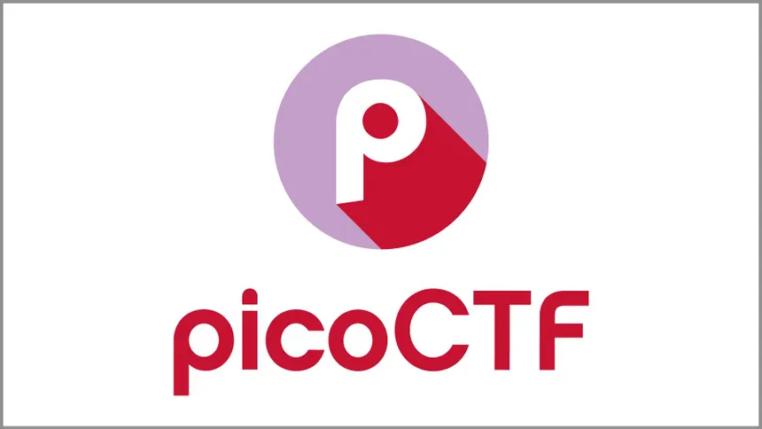

# picoCTF Writeups

[picoCTF](https://picoctf.org/) is a beginner-friendly, **jeopardy-style CTF platform** that spans multiple cybersecurity categories listed below

This repository contains my curated writeups — structured to emphasize **methodology, reproducibility, and learning outcomes**.

## Challenge Categories

- **Web Security** 
- **Forensics**  
- **Binary Exploitation**
- **Cryptography** 
- **General Skills**

---

