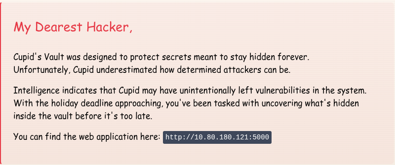
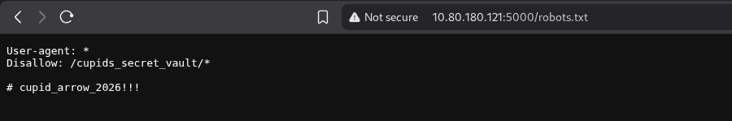
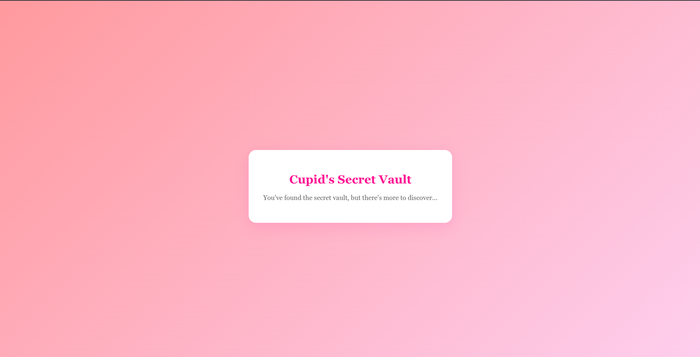
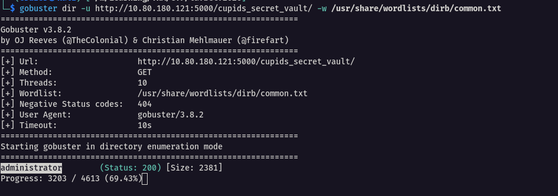
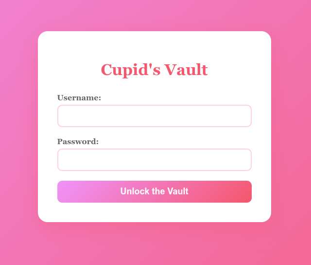
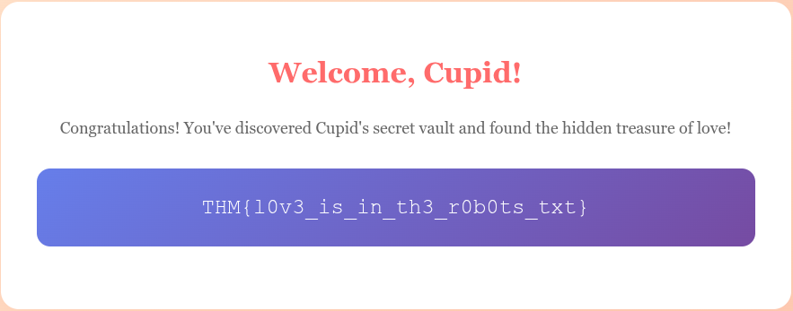

## Room Overview

This challenge is part of the Love at First Breach (LAFB) CTF event on TryHackMe.

The objective is to perform web enumeration, uncover hidden resources, and retrieve the flag.

---
## Initial Reconnaissance

### Application Access



I began by visiting the target website. The landing page appeared to be a platform for sending anonymous letters, with a romantic theme consistent with the LAFB event.


The challenge description mentioned: `dealing with secrets meant to be hidden forever`
This immediately made me think about hidden files and directories — particularly `robots.txt`.

---
## Inspecting robots.txt

`robots.txt` is commonly used to instruct web crawlers which directories should not be indexed. However, in CTF scenarios, it often contains hidden paths or sensitive information.

I navigated to:

```http
http://10.80.180.121:5000/robots.txt
```



The file contained the following:

```text
Disallow: /cupids_secret_vault/*

# cupid_arrow_2026!!!
```

Two important findings stood out:

1. A hidden directory:
   ```
   /cupids_secret_vault/
   ```
2. A suspicious phrase:
   ```
   cupid_arrow_2026!!!
   ```

Both appeared to be deliberate hints.

---
# Exploring the Secret Vault

I navigated to:

```text
/cupids_secret_vault/
```



The page confirmed that I had found the secret vault but suggested that there was still more to uncover.

At this stage:

- `robots.txt` contained no additional clues  
- Page source revealed nothing further  

This suggested that deeper enumeration was required.

---

# Directory Enumeration

Since manual inspection did not reveal anything further, I turned to directory brute-forcing using **Gobuster**.

Example command used:

```bash
gobuster dir -u http://10.80.180.121:5000/cupids_secret_vault/ -w /usr/share/wordlists/dirb/common.txt
```

The scan revealed an additional directory:

```text
/administrator
```



---

# Administrator Panel Access

Navigating to the administrator presented a login page



Recalling the earlier discovery in `robots.txt`:

```text
# cupid_arrow_2026!!!
```

The phrase appeared to resemble a password.

I attempted authentication using:

```text
Username: admin
Password: cupid_arrow_2026!!!
```

The login was successful.



Upon successful authentication, I was able to access the administrative interface and retrieve the flag.

---


