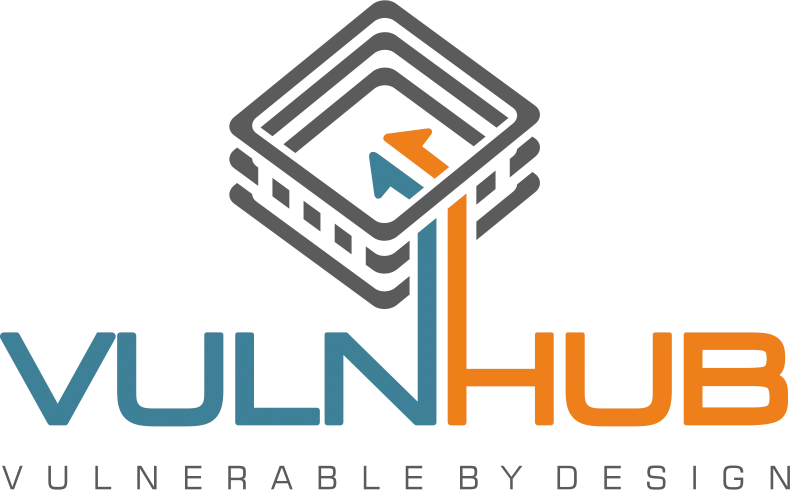

# VulnHub Writeups

[VulnHub](https://www.vulnhub.com/) provides **downloadable vulnerable VMs** for hands-on cybersecurity practice and CTF-style challenges.  

This repo contains my curated writeups — structured, concise, and focused on methodology, enumeration, exploitation, and privilege escalation.

## Categories

- [Single Machines](./single/index.md) 
- [Series Machines](./series/index.md) 

> **Tip:** All machines are legally provided by [VulnHub](https://www.vulnhub.com/) for learning purposes. Always use **isolated lab environments**.

---

